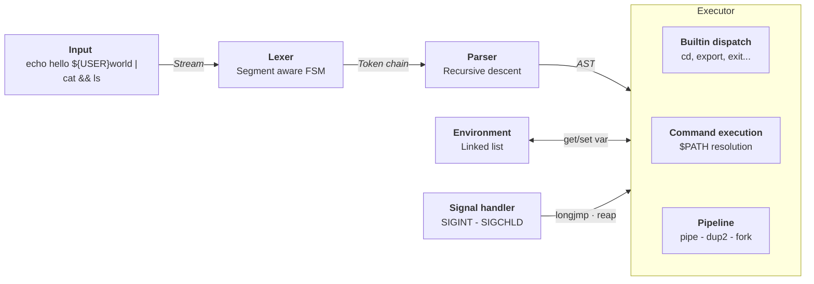

# olive-sh

A minimalist POSIX shell built in C from scratch. This project was initially developed as a deep dive into POSIX interprocess communication and signal management, and continues to be regularly updated. 

>[!IMPORTANT]
>This project only includes macOS support.

## Main Features
- **AST-based interpreter** - the input goes through a FSM-based lexer, producing a token stream, then a recursive descent parser that emits an AST, which the executor runs recursively. Clean separation between lexing, parsing and execution. 
- **Command execution** - `$PATH` resolution, logic operators (`&&`, `||`) and correct `$?` exit-status propagation. 
- **Pipes and redirection** - multiple pipe chains (`|`), `>`, `>>` and `<`.
- **Variable expansion** - environment variables and special parameters (`$?`) with segment aware variable expansion. 
- **Signal handling** - correct `SIGINT` and `SIG_CHLD` behaviour in both interactive and pipeline context. 
- **Builtins** - `echo`, `cd`, `pwd`, `export`, `unset`, `env`, `exit`, plus `errlog` (structured error management) and `olvsh` (runtime option management).


## Build and Run 

The following conditions are prerequisites : 
- macOS (see [Important] notice above)
- `cc`
- `make`

To get started, use the following : 
```bash
git clone https://github.com/louis-leblondolive/olive-sh.git
cd olive-sh
```

To compile, type in :

```bash
make 
```

`olive-sh` builds as `olvsh`. You can run it from the `bin` directory : 
```bash 
./bin/olvsh
```

## Usage

### Basic usage 
`olive-sh` is a command line interpreter. It can run any command from `$PATH`, handle variable assignment and expansion, redirect I/O and much more. 
```bash
> export GREETING="hello"
> echo $GREETING world
hello world
> echo "Exited with status $?"
Exited with status 0
```

### Builtins 
Usual builtins are directly implemented, including `echo`, `cd`, `pwd`, `env`, `export`, `unset` and `exit`.
`$PATH` resolution provides access to any other available command. 

```bash 
# cd + pwd 
> cd tmp && pwd
/Users/.../olive-sh/tmp

# unset 
> export FOO=bar
> unset FOO
> echo $FOO

# env
> env | grep USER
USER=louisleblond-olive
```


### Pipe and redirections 
Multiple pipe chains and redirections are available using `|`, `<`, `>` or `>>`.
```bash 
# Multiple pipe chain 
> echo hello world | cat | cat | cat
hello world

# Redirect stdout to a file, then redirect stdin and read it back 
> echo "olive-sh" > /tmp/out.txt
> cat < /tmp/out.txt
olive-sh

# Append redirection 
> echo "first" > /tmp/out.txt
> echo "second" >> /tmp/out.txt
> cat /tmp/out.txt
first
second

# Pipe exit status is last command status 
>  cat /nonexistent | wc -l
cat: /nonexistent: No such file or directory
0
> echo $?
0
```

>[!NOTE]
>In the last example above, exit status is given by the pipe last command exit status. This setting can be overriden using the `pipefail` option.  

### Logic operators 
Logic operators (`&&` and `||`) are supported. `;` usage is also available.  
```bash 
# && execution example 
> ls /nonexistent && echo "found"
EXECUTION ERROR - process exited with code 1

# || execution example 
> false || echo hello world
hello world
> echo $?
0

# ; execution example 
> echo hello ; echo world
hello
world
```

>[!NOTE]
>In the first example above, `ls` error log is captured and not displayed by default. If the `errlog` option is disabled, a prompt will appear to indicate that the `errlog` command can be run to display the error log. 

### Error reporting 
`olive-sh` condenses error reporting : on error, only an error beacon is displayed alongside the exit code.  
A builtin `errlog` command can be used to display details about the last error. It can be useful if you need to recall an error that occurred earlier. 
>[!TIP]
>Error details can be displayed automatically by enabling the `--errlog` option. See "Runtime options" section below. 

```bash
# error reporting example 
> cat /nonexistant
EXECUTION ERROR - process exited with code 1
Run errlog for more details.

> errlog
Last error details :
Command: cat /nonexistant
Date: 2026-06-13 15:45:04
Info: cat: /nonexistant: No such file or directory

Hint: Details can be shown automatically. To do so, run olvsh --errlog

# error reporting with --errlog enabled 
> cat /nonexistant
EXECUTION ERROR - process exited with code 1
cat: /nonexistant: No such file or directory
```

### Runtime options 
To enable / disable an option, simply run : 
```bash
olvsh --option_name     # enables an option 
olvsh --no-option_name  # disables the option 
```

The following standard options are supported :
- `pipefail`
- `errexit`
- `nounset`
- `xtrace`

Three custom options are also featured : 
- `errlog` : displays error detail systematically               (disabled by default)
- `hints` : allows hints to be printed                          (enabled by default)
- `debug` : display information about the interpreting process  (disabled by default)


## Technical Deep Dive

### Shell general architecture

The interpreter pipeline is divided in three steps. The executor also interacts with the environment and the signal handler. 



- **Lexer**

    Instead of using fragile string splitting, `olive-sh` lexer uses a Finite State Machine (FSM) to ensure parsing robustness. 


    #### Lexer output example 
    ```bash
    > echo "hello ${USER}" | cat && ls

    [DEBUG] Lexed node chain :
    WORD - segment chain :   (LITERAL)[echo]
    WORD - segment chain :   (LITERAL)[hello ]  (VAR)[USER]
    PIPE
    WORD - segment chain :   (LITERAL)[cat]
    AND
    WORD - segment chain :   (LITERAL)[ls]
    ```

>[!TIP]
>This output can be seen directly in the shell. To do so, enalble the `--debug` option.

    #### FSM implementation 
    A simplified version of the FSM used to build the lexer is depicted below. A complete version of this flowchart and its transition matrix are available in the lexer [documentation]().

    ```mermaid
    stateDiagram-v2

    state "START<br><i>inbetween words</i>" as START
    state "WORD<br>Loop: *" as WORD
    state "IN_DOLLAR<br>Loop: a-z A-Z " as IN_DOLLAR
    state "IN_SG_QUOTE" as IN_SG_QUOTE
    state "IN_DB_QUOTE" as IN_DB_QUOTE
    state "IN_DOLLAR_IN_DB_QUOTE<br>Loop: a-z A-Z " as IN_DOLLAR_IN_DB_QUOTE

    [*] --> START

    START --> WORD : *
    START --> OPERATOR : &, |, &#59, <, >

    OPERATOR --> START : *

    WORD --> START : Separators
    WORD --> IN_DOLLAR : $
    WORD --> IN_SG_QUOTE : '
    WORD --> IN_DB_QUOTE : "

    IN_DOLLAR --> WORD : *

    IN_SG_QUOTE --> WORD : '

    IN_DB_QUOTE --> IN_DOLLAR_IN_DB_QUOTE : $
    IN_DB_QUOTE --> WORD : "

    IN_DOLLAR_IN_DB_QUOTE --> IN_DB_QUOTE : *
    ``` 


- **Parser**

- **Executor**


## Repository Structure 
This repository has the following structure : 
```text

./
├── src/
│   ├── shell/
|   |   ├── signals/
│   │   ├── executor/
│   │   ├── lexer/
│   │   └── parser/
|   |
|   ├── env/
|   ├── builtins/
|   ├── ds/
|   ├── utils/
|   |
│   ├── shell_loop.c
│   └── main.c
|
├── include/
│   └── ...
|
├── bin/
│
└── Makefile
```

- **`src`**

    - **`shell`**  
    
        This folder contains the interpreter core, divided along the three classical stages of interpretation:
        - `lexer` provides a FSM-based tokenizer with segment awareness for variable expansion.
        - `parser` produces an AST using recursive descent. 
        - `executor` runs the AST recursively. `exec_internal.c` handles asynchronous command execution, I/O redirection and builtins dispatch. 
        - `signals` contains the signal handler. 

    - **`env`** 

        This folder contains the environment manager. 
        - `env.c` implements the public environment function (export, unset, ...)
        - `env_internal.c` implements the tools used in these function. 

    - **`builtins`**

        This folder contains the builtins command definition. A `builtins.c` file contains a table matching builtins commands name to their associated functions. The functions are defined in separate files. 

    - **`ds`**

        This folder contains the implementation of the data structutures used in the shell. 
        - `token_chain.c` contains the code for the token and segment list used by the lexer. 
        - `ast.c` contains the code for the Abstract Syntax Tree used by both the parser and the executor. 

    - **`utils`**

        This directory contains a custom printer, printing colors and beacons for errors, debug information or hints. 

    - **`main.c` and `shell_loop.c`**

        The shell entry point and main loop. 


- **`include`**

    This folder follows the same structure as `src`, but with headers instead of .c files. 

- **`bin`**

    This folder is the target for all the compiled binary file produced when running `make`. In particular, it contains the `olvsh` binary, used to run the shell.  

## Tests  

## References
- [Beej's Guide to Interprocess Communication](https://beej.us/guide/bgipc/)