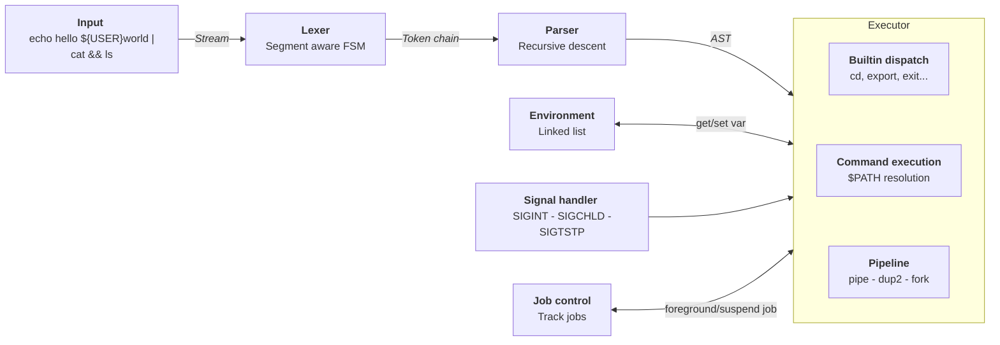
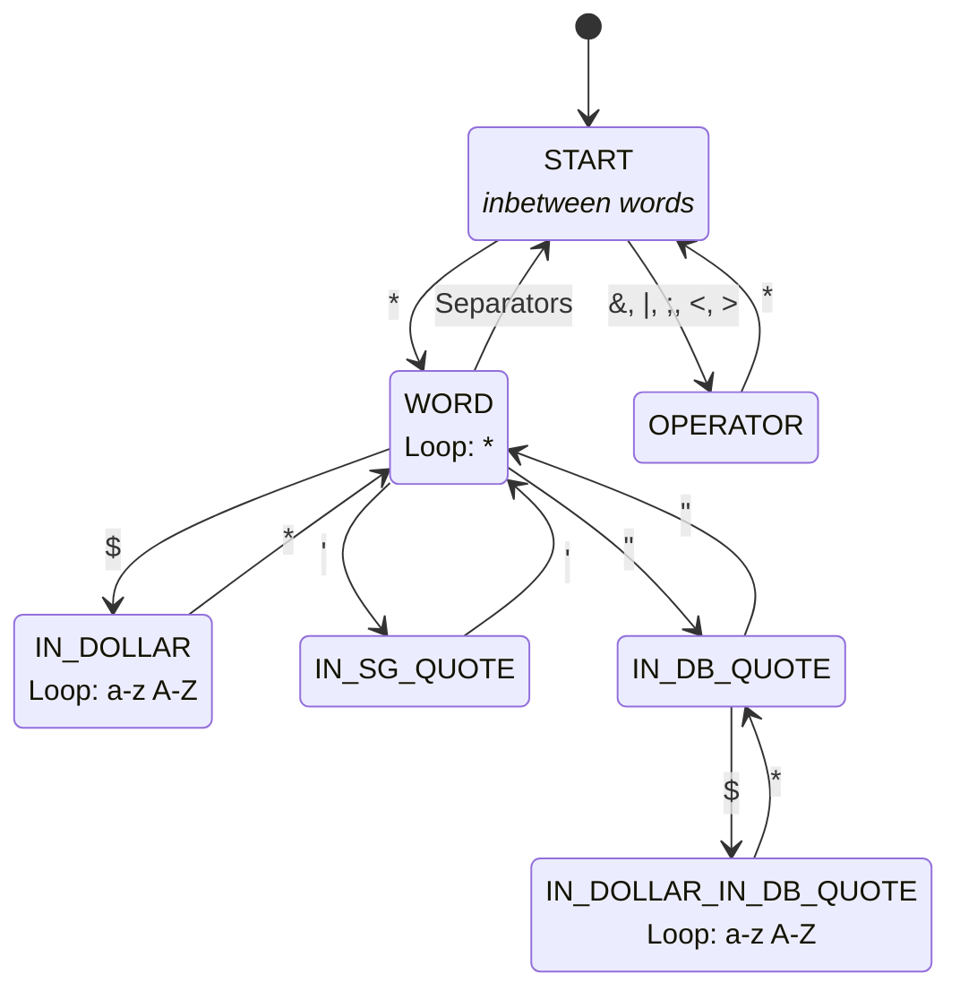
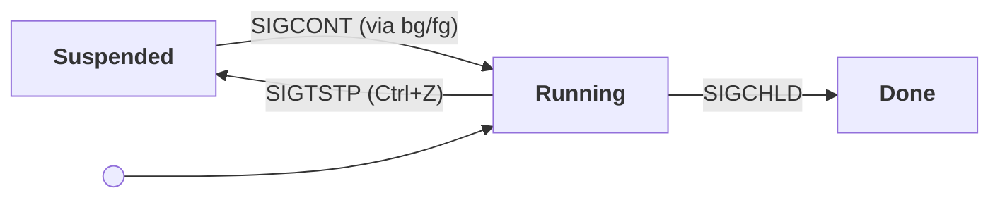

# olive-sh


A minimalist POSIX shell built in C from scratch. This project was initially developed as a deep dive into POSIX interprocess communication and signal management, and continues to be regularly updated. 

>[!IMPORTANT]
>This project includes macOS and Linux support.

## Table-of-Contents
* [Main Features](#main-features)
* [Build and Run](#build-and-run)
* [Usage](#usage)
* [Technical Deep Dive](#technical-deep-dive)
* [Repository Structure](#repository-structure)
* [Tests](#tests)
* [Benchmark](#benchmark)
* [References](#references)


## Main-Features
- **AST-based interpreter** - the input goes through a FSM-based lexer, producing a token stream, then a recursive descent parser that emits an AST, which the executor runs recursively. Clean separation between lexing, parsing and execution. 
- **Command execution** - `$PATH` resolution, logic operators (`&&`, `||`) and correct `$?` exit-status propagation. 
- **Pipes and redirection** - multiple pipe chains (`|`), `>`, `>>` and `<`.
- **Variable expansion** - environment variables and special parameters (`$?`) with segment aware variable expansion. 
- **Job control** - `&`, `bg`/`fg` and `Ctrl+Z` support, with proper process group `pgid`, leadership and terminal ownership (`tcsetpgrp`/`setpgid`). 
- **Signal handling** - correct `SIGINT` and `SIGCHLD` behaviour in both interactive and pipeline context. 
- **Builtins** - `echo`, `cd`, `pwd`, `export`/`unset`, `env`, `exit`, `jobs`, `bg`/`fg` plus `errlog` (structured error management) and `olvsh` (runtime option management).


## Build-and-Run 

The following conditions are prerequisites:
- macOS or Linux (see [Important] notice above)
- `cc`
- `make`

This project also uses GNU `readline` as a dependency. Be sure to have it installed, or to have run:
```bash
brew install readline  # macOS users 
sudo apt install libreadline-dev # Linux users 
```

To get started, use the following:
```bash
git clone https://github.com/louis-leblondolive/olive-sh.git
cd olive-sh
```

Then compile with:

```bash
make 
```

`olive-sh` builds as `olvsh`. You can run it from the `bin` directory : 
```bash 
./bin/olvsh
```

## Usage

### Basic usage 
`olive-sh` is a command line interpreter. It can run any command from `$PATH`, handle variable assignment and expansion, redirect I/O and much more. 
```bash
> export GREETING="hello"
> echo $GREETING world
hello world
> echo "Exited with status $?"
Exited with status 0
```

### Builtins 
Usual builtins are directly implemented, including `echo`, `cd`, `pwd`, `env`, `export`/`unset`, `jobs`, `bg`/`fg` and `exit`.
`$PATH` resolution provides access to any other available command. 

```bash 
# cd + pwd 
> cd tmp && pwd
/Users/.../olive-sh/tmp

# unset 
> export FOO=bar
> unset FOO
> echo $FOO

# env
> env | grep USER
USER=louisleblond-olive
```


### Pipe and redirections 
Multiple pipe chains and redirections are available using `|`, `<`, `>` or `>>`.
```bash 
# Multiple pipe chain 
> echo hello world | cat | cat | cat
hello world

# Redirect stdout to a file, then redirect stdin and read it back 
> echo "olive-sh" > /tmp/out.txt
> cat < /tmp/out.txt
olive-sh

# Append redirection 
> echo "first" > /tmp/out.txt
> echo "second" >> /tmp/out.txt
> cat /tmp/out.txt
first
second

# Pipe exit status is last command status 
>  cat /nonexistent | wc -l
0
> echo $?
0
```

>[!NOTE]
>In the last example above, exit status is given by the pipe last command exit status. This setting can be overriden using the `pipefail` option.  

### Job control
Job control is supported, including `&`, `bg`/`fg` and `Ctrl+Z` management. The `jobs` builtin is 
also available, with a colored display of processes status (not rendered in this snippet). 
```bash
# Run processes in background 
> sleep 10 & sleep 20 & sleep 30 &
[1] - 40044
[2] - 40045
[3] - 40046

# Display background processes 
> jobs
[1] - RUNNING     sleep 10
[2] - RUNNING     sleep 20
[3] - RUNNING     sleep 30

# Foreground job 2, then suspend it with Ctrl+Z
> fg %2
^Z
olive-sh: suspended sleep 20

# Job 1 completion notification
> [1] - DONE        sleep 10    
> jobs
[2] - SUSPENDED   sleep 20
[3] - RUNNING     sleep 30

# Foreground and kill job 3 
> fg %3
^C
> jobs
[2] - SUSPENDED   sleep 20

# Resume job 2 
> bg %2
> [2] - DONE        sleep 20
```


### Logic operators 
Logic operators (`&&` and `||`) are supported. `;` usage is also available.  
```bash 
# && execution example 
> ls /nonexistent && echo "found"
EXECUTION ERROR - process exited with code 1

# || execution example 
> false || echo hello world
hello world
> echo $?
0

# ; execution example 
> echo hello ; echo world
hello
world
```

>[!NOTE]
>In the first example above, `ls` error log is captured and not displayed by default. If the `errlog` option is disabled, a prompt will appear to indicate that the `errlog` command can be run to display the error log. 

### Error reporting 
`olive-sh` condenses error reporting : on error, only an error beacon is displayed alongside the exit code.  
A builtin `errlog` command can be used to display details about the last error. It can be useful if you need to recall an error that occurred earlier. 
>[!TIP]
>Error details can be displayed automatically by enabling the `--errlog` option. See "Runtime options" section below. 

```bash
# error reporting example 
> cat /nonexistent
EXECUTION ERROR - process exited with code 1
Run errlog for more details.

> errlog
Last error details :
Command: cat /nonexistent
Date: 2026-06-13 15:45:04
Info: cat: /nonexistent: No such file or directory

Hint: Details can be shown automatically. To do so, run olvsh --errlog

# error reporting with --errlog enabled 
> cat /nonexistent
EXECUTION ERROR - process exited with code 1
cat: /nonexistent: No such file or directory
```

### Runtime options 
To enable / disable an option, simply run : 
```bash
> olvsh --option_name     # enables an option 
> olvsh --no-option_name  # disables the option 
```

The following standard options are supported :
- `pipefail`
- `errexit`
- `nounset`
- `xtrace`

Three custom options are also implemented: 

| Option   | Description                               | Default  |
|----------|-------------------------------------------|----------|
| `errlog` | displays error detail systematically      | disabled |
| `hints`  | allows hints to be printed                | enabled  |
| `debug`  | display information about interpreting    | disabled |


## Technical-Deep-Dive

### Shell general architecture

The interpreter pipeline is divided into three steps. The executor also interacts with the environment and the signal handler. 



### Lexer

Instead of using fragile string splitting, `olive-sh` lexer uses a Finite State Machine (FSM) to ensure parsing robustness. 


#### Lexer output example 
```bash
> echo "hello ${USER}" | cat && ls

[DEBUG] Lexed node chain :
WORD - segment chain :   (LITERAL)[echo]
WORD - segment chain :   (LITERAL)[hello ]  (VAR)[USER]
PIPE
WORD - segment chain :   (LITERAL)[cat]
AND
WORD - segment chain :   (LITERAL)[ls]
```

>[!TIP]
>This output can be seen directly in the shell. To do so, enable the `--debug` option.

#### FSM implementation 
A simplified version of the FSM used to build the lexer is depicted below. A complete version of this flowchart and its transition matrix are available in the lexer [documentation]().




### Parser 
`olive-sh` parser relies on recursive descent: each precedence level is a function that calls the next tighter-binding level. It produces an Abstract Syntax Tree (AST), whose nodes are labelled with operators and leaves store commands.  The parser follows the following grammar, from `;`/`&` (loosest) to `|` (tightest). Note that `&&` and `||` are treated on two different levels to give `&&` higher precedence, matching bash’s behaviour : 


| Level      | Expression parsed                             |
|------------|------------------------------------------------|
| `list`     | `and ( (';' \| '&') and )*`                     |
| `and`      | `or ( '&&' or )*`                               |
| `or`       | `pipeline ( '\|\|' pipeline )*`                 |
| `pipeline` | `command ( '\|' command )*`                     |


To parse commands, the parser simply consumes `WORD` tokens and assigns them to the argument and redirection fields of the newly created command node. 


#### Parser output example
```bash
> echo "hello ${USER}" | cat && ls
...
[DEBUG] Parsed AST :

		 -- COMMAND NODE --
		COMMAND :  (LITERAL)[echo]
		ARGUMENTS :   (1)  (LITERAL)[hello ]  (VAR)[USER]
		REDIRS :
    |
		 -- COMMAND NODE --
		COMMAND :  (LITERAL)[cat]
		ARGUMENTS :
		REDIRS :
&&
	 -- COMMAND NODE --
	COMMAND :  (LITERAL)[ls]
	ARGUMENTS :
	REDIRS :
```


### Executor 

`olive-sh` executor consists in recursively roaming the AST. Each call returns a tagged union (`exec_res_t`) indicating whether the process was stopped, terminated by a signal, or exited normally, and the resulting exit code or signal number. The tag prevents misinterpreting an exit code as a signal number, which a simple int status couldn't guarantee. 

When meeting an operator node, the behaviour of the executor depends on its type. Sequential operators (`;`, `&&`, `||`) run their first child and wait for the result before deciding to run the second: `;` always runs it, while `&&` and `||` run it conditionally on the first child status. The background operator `&` is also on this level, but doesn't wait: it launches its child asynchronously and immediately proceeds. On the other hand, the (concurrent) pipe operator runs both children at once and links their I/O. 

This distinction matters for process group management. While sequential operators do not modify the pgid or the foregound job, concurrent operators, if the shell itself is in the foreground, fork a leader process,  make it the new foreground job via `setpgid()` and pass its pgid to its children. 

Each command node calculates its own copy of `argv` and `envp`, ensuring that a variable exported earlier in the prompt is visible to commands further on the same line. 


### Job control 
As the kernel routes signals by `pgid` rather than by `pid`, a `Ctrl+C` or `Ctrl+Z` sent to the shell would reach all its processes, rendering the suspension of an independent command group impossible. `olive-sh` job controller addresses this constraint by grouping each of the command's processes under a common `pgid` (see Executor) and using `tcsetpgrp` to give terminal ownership to this group. The job can be suspended or interrupted as a whole. The currently foreground job is then tracked with a singleton accessor. This centralizes access and avoids races between the SIGCHLD handler and the rest of the shell, which plain global variable wouldn't protect against. 

A job moves through several states, with transitions triggered by signals:



Background jobs are stored in a job table, itself stored in a singleton accessor. A done job collector scans the table to delete finished jobs on each REPL loop iteration. The table is dynamic, so the cost of adding a job is constant on average. 

The `fg`/`bg` builtins can directly access the job at the given table index. While `bg` only has to send `SIGCONT` to the corresponding process group, `fg` reassigns it as the foreground job, calls `tcsetpgrp` and waits for it to exit. 


### Signal handler 
Aside from making the shell ignore `Ctrl+C` and `Ctrl+Z` and resetting forked processes' signal handlers, `olive-sh` signal handler is built to avoid reentrancy issues faced when using `readline()` and memory allocation, relying on two different solutions: 

- As `readline()` uses an internal buffer that a `SIGINT` during read might corrupt, the signal handler uses a `volatile sig_atomic_t` flag indicating if readline is currently running. It can then call `siglongjmp` back to a `sigsetjmp` checkpoint inside the REPL loop which resets `readline()` before its next iteration.

- Background jobs termination is indicated by `SIGCHLD` reception. However, removing a job from the job table isn't async-signal-safe: as the table is dynamic, any modification might trigger memory reallocation. Therefore, the handler marks the job with a `DONE` flag, the REPL loop being in charge of collecting and disposing these jobs at the beginning of every iteration.

In order for `SIGCHLD` to indicate the termination of a background job, it cannot be received during foreground command execution. It is therefore suspended during AST execution via `sigprocmask`, and then unblocked when it completes. This ensures any `SIGCHLD` issued during execution will be delivered when it ends instead of being simply ignored and lost. 

## Repository-Structure 
This repository has the following structure : 
```text

./
├── src/
│   ├── shell/
|   |   ├── signals/
|   |   ├── job_control/
│   │   ├── executor/
│   │   ├── lexer/
│   │   └── parser/
|   |
|   ├── env/
|   ├── builtins/
|   ├── ds/
|   ├── utils/
|   |
│   ├── shell_loop.c
│   └── main.c
|
├── include/
│   └── ...
|
├── test/
|
├── bin/
│
└── Makefile
```

- **`src`**

    - **`shell`**  
    
        This folder contains the interpreter core, divided along the three classical stages of interpretation:
        - `lexer` provides a FSM-based tokenizer with segment awareness for variable expansion.
        - `parser` produces an AST using recursive descent. 
        - `executor` runs the AST recursively. `exec_internal.c` handles asynchronous command execution, I/O redirection and builtins dispatch. 
        - `signals` contains the signal handler. 
        - `job_control` provides job handling mechanisms. 

    - **`env`** 

        This folder contains the environment manager. 
        - `env.c` implements the public environment functions (export, unset, ...)
        - `env_internal.c` implements the tools used in these functions. 

    - **`builtins`**

        This folder contains the builtins command definition. A `builtins.c` file contains a table matching builtins commands name to their associated functions. The functions are defined in separate files. 

    - **`ds`**

        This folder contains the implementation of the data structures used in the shell. 
        - `token_chain.c` contains the code for the token and segment list used by the lexer. 
        - `ast.c` contains the code for the Abstract Syntax Tree used by both the parser and the executor. 
        - `job_table.c` defines the job type and provides access to a dynamic job array. 

    - **`utils`**

        This directory contains a custom printer, printing colors and beacons for errors, debug information or hints. 

    - **`main.c` and `shell_loop.c`**

        The shell entry point and main loop. 


- **`include`**

    This folder follows the same structure as `src`, but with headers instead of `.c` files. 

- **`test`**

    This folder contains the shell testing script used for development and CI. 

- **`bin`**

    This folder is the target for all the compiled binary files produced when running `make`. In particular, it contains the `olvsh` binary, used to run the shell.  

## Tests
This project includes an automated smoke test suite (`test/run_tests.sh`) used throughout development to report bugs and validate features. 

### Test Categories
The suite runs 33 assertions across 7 categories :
- Basic command execution and exit codes
- Logic operators (`&&`, `||` and `;`) and pipe chains
- Variable expansion (`export` and `unset`)
- Redirections, including invalid targets
- Job control basics
- Lexer edge cases: quoting, unterminated tokens, oversized words
- Parser edge cases: malformed operators sequences asserted to fail cleanly rather than crash

Clean failures on malformed inputs are tested with an `assert_no_crash` function, treating timeouts (124), ASan aborts (134) and segfaults (139) as failures.  


### Tester Usage 
#### Prerequisites 
```bash
bash
```

#### Usage
```bash
make debug
bash test/run_tests.sh bin/olvsh-debug
```

>[!NOTE]
>CI builds `olvsh` in debug mode (ASan) and runs the test suite with that binary so that memory errors and undefined behaviours are caught by the pipeline.


## Benchmark
This project includes a benchmark script (`test/bench.sh`) that was used to compare `olive-sh` performances to other shells like `bash`, in order to monitor and optimize its performances.  

### Benchmark Results and Analysis
Running the benchmark on the latest version of `olive-sh` returned the following results:

```
scenario                 olvsh (ms)      bash (ms)      ratio
--------                 ----------   ------------      -----
builtin (true)                 2.16           1.88      1.15x
builtin (echo)                 3.14           3.32      0.95x
external command             142.85         139.31      1.03x
&& operator                    2.26           2.04      1.11x
|| operator                    2.31           2.05      1.13x
pipeline                     207.32         173.63      1.19x
variables                      3.30           3.53      0.93x
redirection                    3.13           3.32      0.94x


scenario                 olvsh (ms)       zsh (ms)      ratio
--------                 ----------   ------------      -----
builtin (true)                 2.18           2.95      0.74x
builtin (echo)                 3.13           4.25      0.74x
external command             143.77         146.22      0.98x
&& operator                    2.27           3.09      0.73x
|| operator                    2.33           3.10      0.75x
pipeline                     209.87         189.12      1.11x
variables                      3.31           4.45      0.74x
redirection                    3.13           4.25      0.74x
```

`olive-sh` competes with `bash` on variable expansion and redirection, but is slightly slower on pipelines execution. It also outperforms `zsh`, mainly because it is far less complex, especially when it comes to edge cases (array or subcommands, for instance, are not supported). Note that `zsh` is slower than `bash` due to its more complex line reading system. 

`olive-sh` was optimized using fast paths for non-tty usages. As the implementation of the environment relies on linked lists (O(n) insertion and reading), it would be beaten by the other shells if the environment was bigger, but isn't a real concern as personal environment usually hold about 50 variables. 


### Benchmark Usage
#### Prerequisites 
```bash
hyperfine
bash
```

#### Usage 
Make sure to compile `olive-sh` before running any benchmark:
```bash
make
bash test/bench.sh bin/olvsh 100
```

The benchmark will use `bash` as a reference by default, running 100 commands for each scenario. These can be changed using: 
```bash
bash test/bench.sh -s zsh bin/olvsh 42
``` 


## References
- [Beej's Guide to Interprocess Communication](https://beej.us/guide/bgipc/)