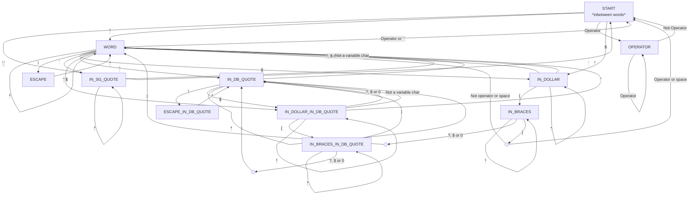

This document details the implementation of the lexical analyser (lexer).

## FSM 
The complete flowchart of the Finite State Machine (FSM) used to build the lexer is represented below. 

## Transition Matrix 

| Initial State | Read Character | Next State           | Associated action |
| ------------- | -------------- | -------------------- | ----------------- |
| START         | ' '            | START                |                   |
| START         | *              | WORD                 | Buffers character (beginning of a new word) |
| START         | Operator       | OPERATOR             |                   |
| START         | $              | IN_DOLLAR            |                   |
| WORD          | Operator or ' '| START                | Starts new token |
| WORD          | \              | ESCAPE               |                   |
| WORD          | $              | IN_DOLLAR            | Creates new VAR segment | 
| WORD          | '              | IN_SG_QUOTE          |                   | 
| WORD          | "              | IN_DB_QUOTE          |                   | 
| WORD          | "$             | IN_DOLLAR_IN_DB_QUOTE| Creates new VAR segment | 
| WORD          | *              | WORD                 |                   |
| OPERATOR      | Operator       | OPERATOR             |                   |
| OPERATOR      | Not an operator| START                | Starts new token  |
| ESCAPE        | *              | WORD                 | Specific symbol matching |
| ESCAPE_IN_DB_QUOTE | *         | IN_DB_QUOTE          | Specific symbol matching |
| IN_DOLLAR     | {              | IN_BRACES            |                   |
| IN_DOLLAR     | ?, $ or 0      | WORD                 | Ends VAR segment and creates new literal segment |
| IN_DOLLAR     | Not a variable char | WORD            | Ends VAR segment and creates new literal segment | 
| IN_DOLLAR     | *              | IN_DOLLAR            |                   |
| IN_DOLLAR_IN_DB_QUOTE | {                   | IN_BRACES_IN_DB_QUOTE | |
| IN_DOLLAR_IN_DB_QUOTE | "                   | WORD                  | Ends VAR segment and creates new literal segment | 
| IN_DOLLAR_IN_DB_QUOTE | ?, $ or 0           | IN_DB_QUOTE           | Ends VAR segment and creates new literal segment | 
| IN_DOLLAR_IN_DB_QUOTE | Not a variable char | IN_DB_QUOTE           | Ends VAR segment and creates new literal segment | 
| IN_DOLLAR_IN_DB_QUOTE | *                   | IN_DOLLAR_IN_DB_QUOTE | |
| IN_BRACES     | ?, $ or 0 followed by } | START if followed by operator or ' ', WORD otherwise | |
| IN_BRACES     | }                       | START if followed by operator or ' ', WORD otherwise | |
| IN_BRACES     | *                       | IN_BRACES                                            | |
| IN_BRACES_IN_DB_QUOTE | ?, $ or 0 followed by } | IN_DB_QUOTE           | |
| IN_BRACES_IN_DB_QUOTE | }                       | IN_DB_QUOTE           | |
| IN_BRACES_IN_DB_QUOTE | *                       | IN_BRACES_IN_DB_QUOTE | |
| IN_SG_QUOTE   | ' | WORD        | | 
| IN_SG_QUOTE   | * | IN_SG_QUOTE | | 
| IN_DB_QUOTE   | " | WORD                  | |
| IN_DB_QUOTE   | \ | ESCAPE_IN_DB_QUOTE    | |
| IN_DB_QUOTE   | $ | IN_DOLLAR_IN_DB_QUOTE | Ends literal segment and creates new VAR segment |
| IN_DB_QUOTE   | * | IN_DB_QUOTE           | |